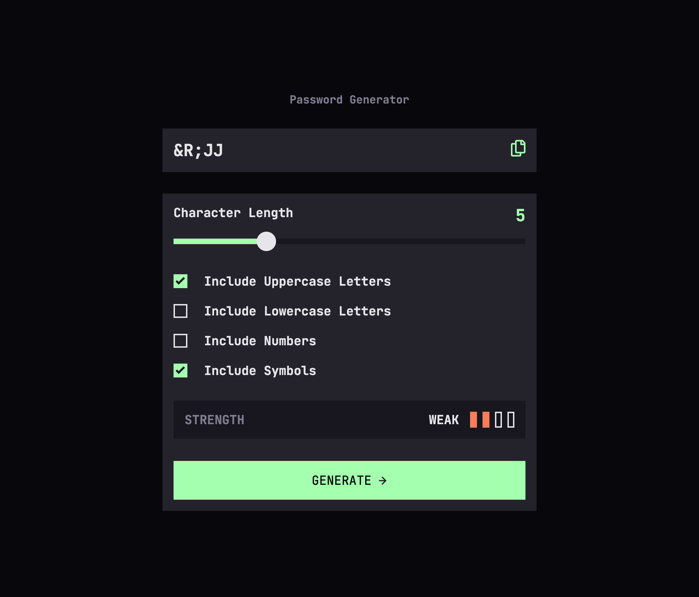

# Frontend Mentor - Password generator app solution

This is a solution to the [Password generator app challenge on Frontend Mentor](https://www.frontendmentor.io/challenges/password-generator-app-Mr8CLycqjh). Frontend Mentor challenges help you improve your coding skills by building realistic projects.

## Table of contents

- [Overview](#overview)
  - [The challenge](#the-challenge)
  - [Screenshot](#screenshot)
  - [Links](#links)
- [My process](#my-process)
  - [Built with](#built-with)
  - [What I learned](#what-i-learned)
  - [Continued development](#continued-development)
  - [Useful resources](#useful-resources)
- [Author](#author)

## Overview

### The challenge

Users should be able to:

- Generate a password based on the selected inclusion options
- Copy the generated password to the computer's clipboard
- See a strength rating for their generated password
- View the optimal layout for the interface depending on their device's screen size
- See hover and focus states for all interactive elements on the page

### Screenshot



### Links

- Solution URL: [Github](https://github.com/delroscol98/Password-Generator)
- Live Site URL: [Github Pages](https://delroscol98.github.io/Password-Generator/)

## My process

### Built with

- Semantic HTML5 markup
- CSS custom properties
- Flexbox
- CSS Grid
- Mobile-first workflow

### What I learned

- Custom checkboxes and range inputs
- Random string output using ASCII character codes.

```css
.checkboxInclude__checkbox {
  appearance: none;
  font: inherit;
  color: currentColor;
  width: 2rem;
  height: 2rem;
  border: 2px solid #e6e5ea;
  transition: all 0.2s;
}
.checkboxInclude__checkbox:hover {
  cursor: pointer;
  border: 2px solid #a4ffaf;
}
.checkboxInclude__checkbox:checked {
  background-image: url(../../starter-code/assets/images/icon-check.svg);
  background-size: auto;
  background-repeat: no-repeat;
  background-position: center;
  background-color: #a4ffaf;
  border: none;
}
```

```js
const generatePassword = () => {
  const charLength = document.querySelector(".characterLength__range").value;
  const includeUpper = document.getElementById("uppercase").checked;
  const includeLower = document.getElementById("lowercase").checked;
  const includeNums = document.getElementById("numbers").checked;
  const includeSym = document.getElementById("symbols").checked;

  //Creates character code array based on user input
  let charCodes = [];
  const passwordCharacters = [];
  let strengthCount = 0;
  if (includeUpper) {
    charCodes = charCodes.concat(UPPERCASE_CHAR_CODES);
    strengthCount++;
    if (charLength < 5) strengthCount = 1;
    if (charLength >= 5 && charLength <= 9) strengthCount = 2;
    if (!includeUpper) {
      strengthCount--;
    }
  }
  if (includeLower) {
    charCodes = charCodes.concat(LOWERCASE_CHAR_CODES);
    strengthCount++;
    if (charLength < 5) strengthCount = 1;
    if (charLength >= 5 && charLength <= 9) strengthCount = 2;
    if (!includeLower) {
      strengthCount--;
    }
  }
  if (includeNums) {
    charCodes = charCodes.concat(NUMBER_CHAR_CODES);
    strengthCount++;
    if (charLength < 5) strengthCount = 1;
    if (charLength >= 5 && charLength <= 9) strengthCount = 2;
    if (!includeNums) {
      strengthCount--;
    }
  }
  if (includeSym) {
    charCodes = charCodes.concat(SYMBOL_CHAR_CODES);
    strengthCount++;
    if (charLength < 5) strengthCount = 1;
    if (charLength >= 5 && charLength <= 9) strengthCount = 2;
    if (!includeSym) {
      strengthCount--;
    }
  }

  //Loops through character code array and produces a random selection of characters to create and return a password as a string
  for (let i = 0; i < charLength; i++) {
    const characterCode =
      charCodes[Math.floor(Math.random() * charCodes.length)];
    passwordCharacters.push(String.fromCharCode(characterCode));
  }
  return [passwordCharacters.join(""), strengthCount];
};
```

### Continued development

- Working with ASCII character codes
- Password strength algorithm

### Useful resources

- [Web Dev Simplified](https://www.youtube.com/watch?v=iKo9pDKKHnc) - This helped me with creating a random password from ASCII characters.
- [MDN Docs](https://developer.mozilla.org/en-US/docs/Web/API/Clipboard/writeText) - This helped me to understand Navigator.clipboard.writeText() in order to copy text to be pasted later.
- [Modern CSS](https://moderncss.dev/pure-css-custom-checkbox-style/) - This helped me to create custom checkboxes

## Author

- Frontend Mentor - [@delroscol98](https://www.frontendmentor.io/profile/delroscol98)
